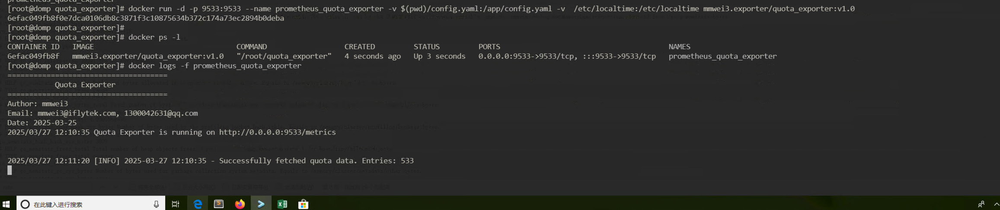

---

### **README.md**

# **Quota Exporter**  

## **1. Project Introduction**  
`quota_exporter` is a Prometheus Exporter developed in Go, designed to collect storage quota information from an API endpoint and expose it via an HTTP endpoint for Prometheus monitoring.  

This project supports configurable storage quota retrieval methods and includes error handling and timeout control to ensure the exporter remains operational even if some storage systems fail.  

---

## **2. Features**  
✅ **Configurable API endpoint**: The exporter can fetch data from any specified API endpoint.  
✅ **Prometheus integration**: Automatically exposes quota data for Prometheus scraping.  
✅ **Timeout and error handling**: Ensures the exporter stays operational despite potential failures.  
✅ **Lightweight and efficient**: Uses Goroutines for concurrent data collection.  
✅ **Open-source**: Freely modifiable and extendable.  

---

## **3. Installation**  
### **3.1 Build from Source**  
Ensure you have **Go 1.24+** installed, then run the following commands:  

```bash
git clone https://code.iflytek.com:30004/mmwei3/quota_exporter.git
cd quota_exporter
go mod tidy
go build -o quota_exporter ./cmd/main.go
```

Run `quota_exporter`:  
```bash
./quota_exporter
```

### **3.2 Run with Docker**  
To run `quota_exporter` in a Docker container, use the following commands to build and start it:  

```bash
docker build -t quota_exporter .
docker run -d -p 9533:9533 --name quota_exporter -v $(pwd)/config.yaml:/app/config.yaml -v /etc/localtime:/etc/localtime  quota_exporter
```

---

## **4. Configuration**  
All storage system configurations are stored in `config.yaml`. Example:  

```yaml
quota_exporter:
  # API address (configurable)
  api_url: "http://172.20.35.42:9118/v1/pull/storageQuota"

  # Data pull interval (seconds), default 10 minutes (600 seconds)
  scrape_interval: 600

server:
  listen_address: "0.0.0.0"
  listen_port: 9533
```

- **api_url**: The API endpoint used to retrieve storage quota data.  
- **scrape_interval**: The interval at which data is pulled from the API.  
- **listen_address**: The address the exporter listens on.  
- **listen_port**: The port the exporter listens on.

By default, `quota_exporter` loads configuration from `config.yaml`. To specify a custom path, use the `-config` flag:  

```bash
./quota_exporter -config=/path/to/your/config.yaml
```

---

## **5. Running the Exporter**  

### **5.1 Run Directly**  
```bash
./quota_exporter
```

### **5.2 Run as a systemd Service (Recommended for Linux)**  

Create a systemd service file at `/etc/systemd/system/quota_exporter.service`:  

```ini
[Unit]
Description=Quota Exporter
After=network.target

[Service]
ExecStart=/path/to/quota_exporter
Restart=always
User=nobody
Group=nogroup

[Install]
WantedBy=multi-user.target
```

Enable and start the service:  

```bash
sudo systemctl daemon-reload
sudo systemctl enable quota_exporter
sudo systemctl start quota_exporter
```

---

## **6. Monitoring Metrics**  

Once running, `quota_exporter` provides an HTTP endpoint at port `9533` under `/metrics`. Example output:  

```plaintext
# HELP quota_size_available Quota size for storage
# TYPE quota_size_available gauge
quota_size_available{storage="train28", group_name: "bitbrain"} 1050000
quota_size_used{storage="train28", group_name: "bitbrain", } 500000
quota_size_free{storage="train28", group_name: "bitbrain"} 550000
```

To configure Prometheus to scrape metrics from `quota_exporter`, add the following to your Prometheus config:  

```yaml
scrape_configs:
  - job_name: 'quota_exporter'
    static_configs:
      - targets: ['localhost:9533']
```

---

## **7. Project Structure**  

```
quota_exporter/
├── cmd/                  # Entry point
│   ├── main.go           # Main program
├── collector/            # Data collectors
│   ├── quota_collector.go # Collects quota data from API
├── config/               # Configuration management
│   ├── config.yaml       # Configuration file
│   ├── config.go         # Configuration loader
├── docs/                 # Documentation
│   ├── README.md         # Readme file
│   ├── API.md            # API documentation
├── scripts/              # Deployment and execution scripts
│   ├── build.sh          # Build script
│   ├── start.sh          # Startup script
│   ├── deploy.sh         # Deployment script
├── test/                 # Unit tests
│   ├── quota_test.go     # Storage quota test cases
├── Dockerfile            # Docker image build file
├── Makefile              # Makefile for building
├── go.mod                # Dependency management
├── go.sum                # Dependency checksum
├── LICENSE               # Open-source license
└── README.md             # Project documentation
```

---

## **8. Contributing**  
We welcome contributions to improve this project!  

### **8.1 How to Contribute**  
1. Fork the repository.  
2. Create a new branch: `git checkout -b feature-xxx`.  
3. Commit your changes: `git commit -m "Add xxx feature"`.  
4. Push to your branch: `git push origin feature-xxx`.  
5. Submit a pull request (PR).  

---

## **9. License**  
This project is licensed under the **MIT License**.  

---

## **10. Contact Information**  
- **Author**: mmwei3  
- **Email**: mmwei3@iflytek.com, 1300042631@qq.com  
- **Phone**: 17855350258  
- **Date**: 2025-03-20  

---

